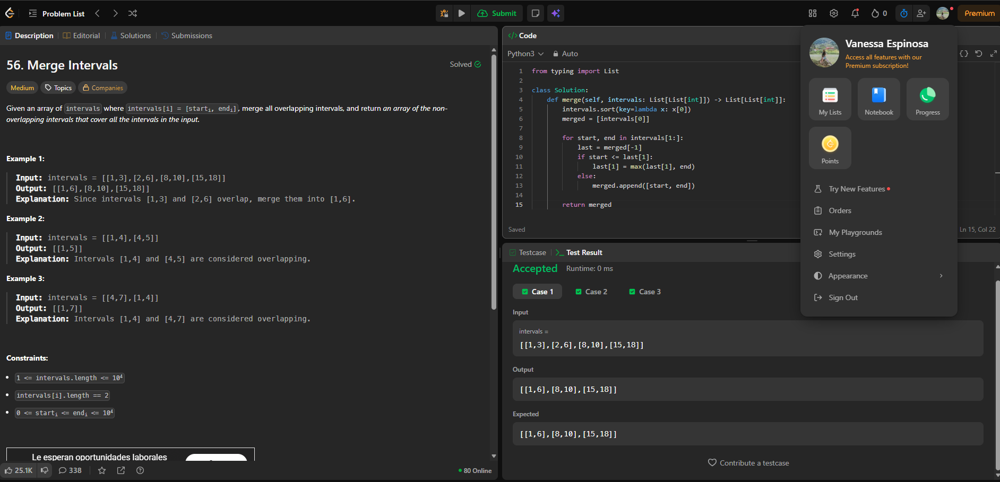

# 56. Merge Intervals

## Enlace: [LeetCode 56 - Merge Intervals](https://leetcode.com/problems/merge-intervals/)

### Familia: Ordenamiento

**Idea:** Primero ordené los intervalos según su inicio. Después recorrí la lista comparando cada intervalo con el último que agregué al resultado. Si se cruzan o uno termina justo cuando empieza el otro, los uno y tomo el valor final más grande. Si no, agrego el intervalo como uno nuevo.

**Complejidad:** El tiempo es `O(n log n)`, debido al ordenamiento inicial. Luego solo recorro la lista una vez. El espacio es `O(n)`, porque se necesita una lista para guardar los intervalos resultantes, donde `n` es la cantidad de intervalos.

## Evidencia

