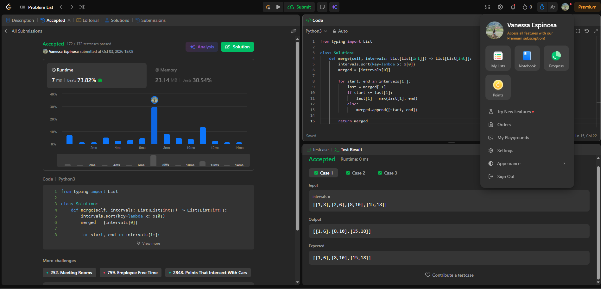

# 56. Merge Intervals

## Enlace: [LeetCode 56 - Merge Intervals](https://leetcode.com/problems/merge-intervals/)

**Familia:** ordenamiento (con barrido lineal / criterio greedy)  
**Idea:** se ordenan los intervalos por inicio; luego se recorren una sola vez
manteniendo el último intervalo fusionado. Si el inicio actual es <= al fin
del último, se solapan y se extiende el fin con `max`; si no, se agrega un
nuevo intervalo. El orden garantiza que solo hay que comparar con el último.  
**Complejidad:** tiempo O(n log n) por el ordenamiento (el barrido es O(n)),
con n = número de intervalos; espacio O(n) para la lista resultante
(más O(log n) por la pila del sort, según la implementación).

## Evidencia

